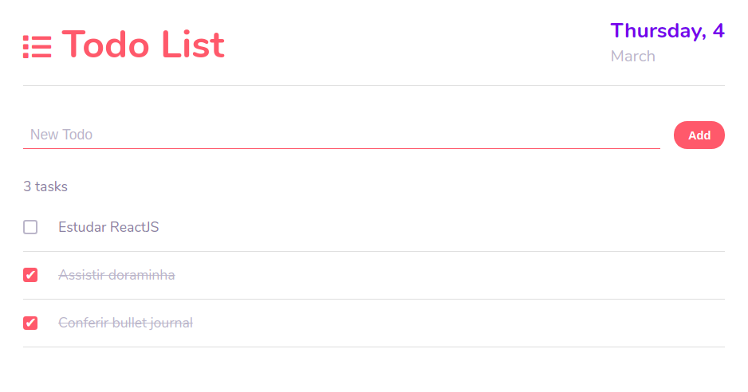

# React Todo List App



A simple todo list app made with React.

## Installation

Clone the repository and run command below to install node dependencies
```
npm install or yarn install
```
## Start
```
npm start or yarn start
```

## Technologies
- React
- Create-React-App